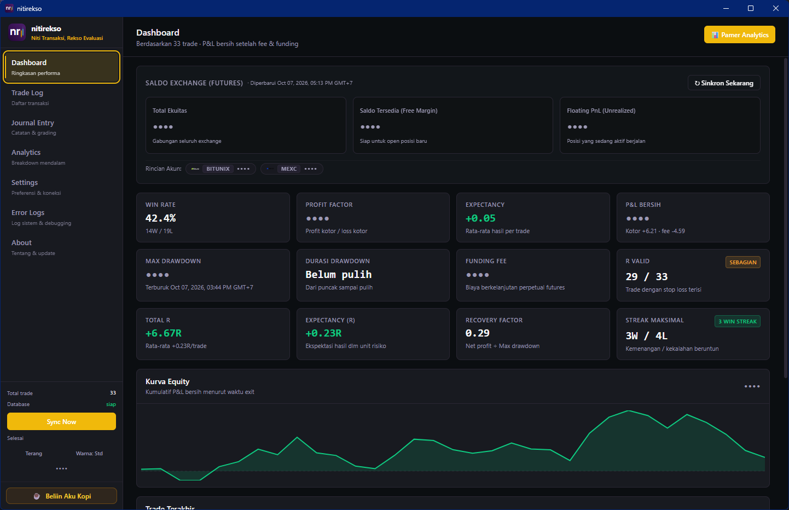
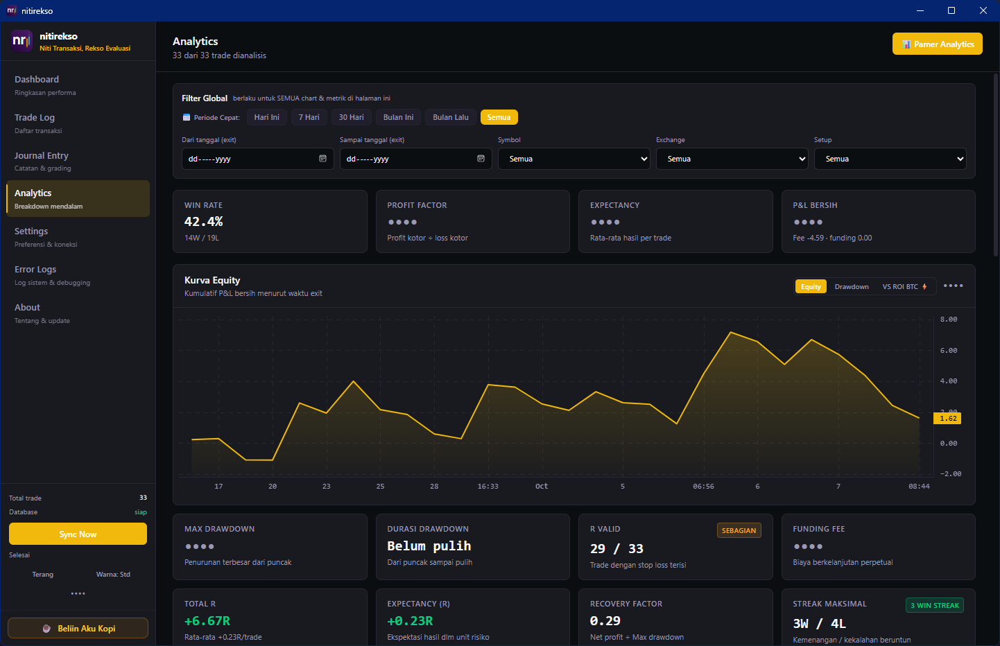

# nitirekso (ꦤꦶꦠꦶꦫꦼꦏ꧀ꦱ) — Aplikasi Trading Journal Otomatis & Analitik Kripto Futures

[](https://kaleksananbarqi.github.io/nitirekso/)
[](https://github.com/KaleksananBarqi/nitirekso)
[](https://react.dev/)
[-10b981?style=flat-square)](https://sqlite.org/)
[](LICENSE)
[](plans/SESSION.md)

> **"Niti Transaksi, Rekso Evaluasi"**
> 
> *Aplikasi Trading Journal Otomatis, Offline-First, dan 100% Privat untuk Evaluasi Disiplin Trading Kripto Futures (Bybit, Binance, BingX, MEXC, & Bitunix).*

---

## 📖 Filosofi Nama: nitirekso

Nama **nitirekso** berakar dari kearifan bahasa Jawa:
* **Niti (ꦤꦶꦠꦶ)**: Memiliki arti *menulis, mencatat, memeriksa, dan meneliti secara saksama*. Dalam trading, tidak ada perbaikan tanpa pencatatan data yang jujur dan presisi atas setiap eksekusi.
* **Rekso (ꦫꦼꦏ꧀ꦱ)**: Memiliki arti *menjaga, merawat, dan memelihara*. Dalam trading, menjaga modal (*capital preservation*) dan merawat kedisiplinan mental adalah kunci bertahan dalam jangka panjang.

**nitirekso** hadir untuk membantu trader mencatat histori transaksi tanpa repot mengetik ulang (*read-only sync*), mengevaluasi kualitas eksekusi secara objektif, serta merawat psikologi dari bahaya *revenge trading* dan FOMO di semua kondisi market.

---

## 🖼️ Tangkapan Layar (Preview Aplikasi)

| 📊 Dasbor Portofolio & Saldo Live | 📋 Trade Log & Riwayat Sinkronisasi |
|:---:|:---:|
| [](docs/assets/screenshots/dasbor.png) | [](docs/assets/screenshots/trade%20log.png) |
| *Visualisasi ringkasan modal, saldo real-time 5 exchange, equity curve harian, dan metrik risiko kuantitatif.* | *Daftar posisi tertutup otomatis dari exchange lengkap dengan durasi, tag setup, grade eksekusi, R-multiple, dan PnL.* |

| 📝 Jurnal Transaksi & Evaluasi SOP | 📈 Analitik Kuantitatif & Benchmark ROI BTC |
|:---:|:---:|
| [](docs/assets/screenshots/journal%20trade.png) | [](docs/assets/screenshots/analytics.png) |
| *Catat tesis analisa pre-trade, review psikologi post-trade, evaluasi kepatuhan SOP, dan pelacak tag emosi per transaksi.* | *Evaluasi performa portofolio vs Buy & Hold Bitcoin (Alpha), kurva drawdown, heatmap kalender, dan distribusi R.* |

| 🏆 Kartu Pamer PnL Flex (Viral Ready) | 🎨 Studio Kustomisasi Desain & Tema |
|:---:|:---:|
| [](docs/assets/screenshots/pnl%20share.png) | [](docs/assets/screenshots/pnl%20custom.png) |
| *Kartu pamer performa rasio 1:1 tajam resolusi Retina 2x dengan avatar personal, watermark, dan catatan tesis.* | *Atur wallpaper video/gambar kustom, gradien pencahayaan terarah, tema warna visual, dan mode privasi (sensor PnL).* |

---

## 🚀 Mengapa Memilih nitirekso? (Keunggulan Utama)

1. **Performa Native Super Ringan (Tauri v2 + Rust)**  
   Dibangun di atas engine native **Rust** dan **Tauri v2**, nitirekso hanya mengonsumsi memori ~30–50 MB RAM saat diam (turun lebih dari 80% dibanding aplikasi berbasis Electron), start instan, serta ukuran file biner yang ringkas.
2. **100% Privat & Offline-First (Local Database)**  
   Data jurnal finansial dan trading Anda tersimpan di mesin lokal dalam database SQLite terenkripsi. Tidak ada database server perantara, tidak ada cloud telemetry, dan tidak ada pelacak analytics yang membaca portofolio Anda.
3. **Koneksi Read-Only 5 Exchange Terpercaya**  
   Mendukung integrasi resmi **Bybit**, **Binance**, **BingX**, **MEXC**, dan **Bitunix**. Hanya memerlukan izin baca (*read-only*), tanpa kapabilitas order maupun penarikan dana (*withdrawal*). Kredensial diamankan menggunakan enkripsi native Rust AES-256-GCM.
4. **Eksekusi vs Hasil (Execution Grade A/B/C/D)**  
   nitirekso memisahkan *grade eksekusi* dari *profit/loss*. Eksekusi sesuai rencana trading bisa saja berakhir rugi (*good loss*); sebaliknya, melanggar aturan bisa saja menghasilkan cuan beruntung (*bad win*). nitirekso melatih Anda mengevaluasi proses, bukan sekadar hasil.
5. **Studio Pembuat Konten PnL & Video Media Sosial (TikTok/Reels/Shorts Ready)**  
   Buat kartu pamer performa berkualitas tinggi Retina 2x, ekspor video MP4 *lossless faststart* (anti-potong 3 detik di TikTok), frame vertikal `9:16`, audio background video, ekspor GIF animasi offline murni, dan generator caption otomatis ramah SEO.
6. **Wawasan Pola Trading Berbasis AI & Benchmark Alpha**  
   Bandingkan hasil trading langsung terhadap strategi *Buy & Hold* Bitcoin (**Analytics VS ROI BTC**) dan manfaatkan integrasi opsional model AI (OpenAI Chat Completions) untuk audit psikologi dan kebocoran modal.

---

## 📊 Rangkuman Fitur Lengkap

### 1. Sinkronisasi Otomatis 5 Exchange & Saldo Akun (Unified Sync)
- **5 Exchange Futures**: Dukungan resmi untuk **Bybit** (Linear V5), **Binance** (USDT-M Futures), **BingX** (Perpetual Swap), **MEXC Futures**, dan **Bitunix Futures**.
- **Unified Sync 1-Klik**: Sinkronisasi riwayat posisi tertutup, trade fills, komisi fee, funding fee, dan saldo margin futures secara serentak dalam satu alur terpadu.
- **Idempotent Engine**: Sinkronisasi berulang aman 100%, mencegah duplikasi data transaksi.
- **Widget Saldo Live Multi-Exchange**: Menampilkan Total Equity, Free Margin, Floating PnL, dan rincian saldo per exchange langsung di Dashboard.
- **Logo Exchange Otomatis & Referral**: Logo resmi exchange dan badge kode referral langsung tersemat di kartu pamer performa.

### 2. Jurnal Transaksi & Evaluasi Psikologi
- Catatan tesis pre-trade dan review post-trade.
- Sistem tagging fleksibel multi-nilai (misal: `#Breakout`, `#FOMO`, `#NewsTrade`).
- Pelacak emosi trader sebelum dan sesudah eksekusi dengan filter toggle dinamis.
- Checklist kepatuhan SOP trading untuk menguji kedisiplinan eksekusi.
- Lampiran screenshot chart (disimpan secara lokal dan aman dari path traversal).
- Perhitungan otomatis Risk-to-Reward Rencana (`plannedRr`) dengan dukungan input desimal natural.

### 3. Analitik Trading, Benchmark Alpha & Metrik Risiko Kuantitatif
- **Equity & Drawdown Curve**: Grafik interaktif responsif berbasis `lightweight-charts` v5.
- **Analytics VS ROI BTC (Alpha Benchmark)**: Evaluasi objektif perbandingan performa portofolio vs Buy & Hold Bitcoin pada periode trading yang sama, didukung 4-tier failover kline API.
- **Metrik Risiko Kuantitatif**: Menghitung **Total R** (akumulasi kelipatan risiko), **Expectancy R** (nilai harapan matematis per trade dalam R), **Recovery Factor**, dan **Max Consecutive Streak** (rekor menang/kalah beruntun).
- **Heatmap Kalender PnL**: Memetakan hari paling menguntungkan dan hari rawan kerugian.
- **Metrik Utama Finansial**: Net PnL, Win Rate %, Profit Factor, Expectancy, Average Win/Loss Ratio.
- **Histogram Distribusi R-Multiple**: Visualisasi sebaran rasio risiko-imbalan aktual dari setiap trade.
- **Filter Global Lintas Halaman**: Filter berdasarkan exchange, pasangan simbol, setup tag, tanggal, dan rentang PnL.

### 4. Studio Pamer PnL Flex, Ekspor Video & GIF Animasi
- **Bento Grid 8-Slot**: Tata letak modern padat informasi (Win Rate, Total PnL, Profit Factor, Total Trades, Total R, Recovery Factor, Max Streak, Expectancy R).
- **Pilihan Aspek Rasio Lengkap**: Rasio `1:1` Square, `16:9` Landscape, `4:5` Feed, dan `9:16` Portrait vertikal.
- **Lossless MP4 +faststart Remuxing**: Menyatukan atom `moov` di awal file MP4 secara instan (~50ms) sehingga video berdurasi penuh tidak dipotong menjadi 3 detik oleh algoritma TikTok.
- **Audio Latar Belakang (Audio Muxing Pipeline)**: Menyertakan musik/audio dari video wallpaper kustom ke berkas MP4 hasil ekspor.
- **Generator Caption Otomatis (Caption Maker)**: Panel pembuat teks caption otomatis ramah SEO (#DYOR, #tradingjournal) berbasis analisa transaksi riil dengan tombol salin 1-klik.
- **Ekspor GIF Animasi Offline**: Engine murni TypeScript (GIF89a) tanpa dependensi library eksternal C++.
- **Video Wallpaper & Directional Dimming**: Dukungan wallpaper video loop (MP4/WebM) dan kontrol arah gradien pencahayaan (Top-Right ala bursa tier-1, Left-Right, Radial).
- **Mode Sensor Privasi PnL (Hide P&L)**: Tombol 1-klik untuk menyamarkan nominal PnL menjadi "••••" demi keamanan saat berbagi ke media sosial atau live streaming.
- **Kustomisasi Tema Visual Bebas**: Color picker interaktif untuk skema warna aplikasi dan kartu PnL.

### 5. Ekspor & Pemulihan Cadangan Mandiri (Backup & Restore)
- **Restore Backup Folder Lokal (v1.8.1)**:
  - Pemulihan fisik database SQLite 1-klik dari folder cadangan lokal menggunakan *SQLite Online Backup API* (`rusqlite::backup::Backup`).
  - Menjalankan migrasi skema otomatis pasca-restore agar cadangan lawas langsung kompatibel dengan versi terbaru.
  - Pemulihan seluruh koleksi screenshot lokal secara utuh.
  - Fallback otomatis ke snapshot JSON jika file database fisik tidak ditemukan.
- **Ekspor Jurnal Fleksibel**: Format **CSV** (UTF-8 BOM siap Excel), **JSON**, dan cetak dokumen **PDF** beresolusi tinggi.
- **Backup Google Drive Dual-Mode**:
  - *Mode 1 (Folder Lokal)*: 1-Klik sinkron ke folder Google Drive desktop tanpa ribet setup API.
  - *Mode 2 (OAuth PKCE Direct)*: Sinkronisasi cadangan langsung ke cloud via OAuth aman.

---

## 🛠️ Panduan Menjalankan & Pengembangan

### Prasyarat
- Node.js versi 18+ (LTS disarankan)
- NPM versi 9+
- **Rust** & Cargo (via `rustup`)
- C++ Build Tools (untuk kompilasi dependensi Rust di Windows)

### Langkah Instalasi
```bash
# Clone repository
git clone https://github.com/KaleksananBarqi/nitirekso.git
cd nitirekso

# Pasang dependensi
npm install

# Buka aplikasi dalam mode development
npm run dev:tauri
```

### Membuat Installer Desktop Multi-Platform
```bash
# Menghasilkan installer mandiri sesuai platform OS host
npm run build:tauri
```
Hasil build tersimpan di folder `src-tauri/target/release/bundle/`:
* **Windows**: `.msi` dan `.exe` (NSIS)
* **macOS**: `.dmg` dan `.app`
* **Linux**: `.AppImage` dan `.deb`

---

## 🧪 Rangkaian Uji & Verifikasi Otomatis

nitirekso dilengkapi **349 pengujian otomatis** untuk menjamin kestabilan mutlak data finansial:

```bash
npm run verify              # Rangkaian lengkap (Typecheck + Semua Fase)
npm run verify:fase1        # 45 checks — Database SQLite & isolasi jurnal manual
npm run verify:fase2        # 66 checks — Mapper MEXC & idempotensi sinkronisasi
npm run verify:fase3        # 63 checks — Request signing Bitunix & isolasi multi-exchange
npm run verify:metrics      # 93 checks — Kalkulasi metrik trading terverifikasi
npm run verify:packaged     # 31 checks — Integritas installer & native addons
npm run verify:acceptance   # 51 checks — Kriteria penerimaan acceptance criteria
```

---

## 🔒 Standar Keamanan & Privasi

- **Penyimpanan Kredensial**: Menggunakan *keychain* bawaan OS yang dikelola secara aman oleh Rust `keyring` dan enkripsi lokal AES-256-GCM. Kredensial API tidak pernah disimpan dalam bentuk plaintext.
- **Alur Data Satu Arah**: Kredensial hanya mengalir dari Frontend ke Backend (Tauri Rust API). Tampilan UI tidak pernah dapat membaca kembali kunci API rahasia Anda.
- **Content Security Policy (CSP)**: Diatur ketat langsung dari konfigurasi Tauri untuk memastikan tidak ada kebocoran data ke luar.
- **Mode Sembunyikan PnL (Hide P&L)**: Satu klik tombol mata untuk menyembunyikan nominal dolar saat Anda ingin berbagi layar (*screen sharing*) atau merekam video.

---

## 📁 Struktur Direktori

```text
nitirekso/
├── build/                 # Resource icon aplikasi & installer (.ico, .png)
├── src-tauri/             # Backend Tauri v2 (Rust runtime)
│   ├── src/
│   │   ├── commands/      # IPC endpoint commands (Tauri API handlers)
│   │   ├── db/            # Engine SQLite lokal rusqlite & migrasi skema
│   │   ├── sync/          # Engine sinkronisasi multi-exchange (Bybit, Binance, BingX, MEXC, Bitunix)
│   │   ├── utils/         # Helper functions, video remuxer, & business logic di Rust
│   │   └── lib.rs         # Entry point aplikasi Rust
│   ├── tauri.conf.json    # Konfigurasi Tauri v2
│   └── Cargo.toml         # Manifest pustaka Rust
├── src/                   # Frontend Renderer (React 19 + Tailwind CSS v4)
│   ├── assets/            # Logo SVG & Favicon resmi nitirekso
│   ├── components/        # Komponen UI, modal pamer PnL, dan visualisasi chart
│   ├── hooks/             # Custom hooks (useTheme, useTrades, useHidePnl)
│   ├── routes/            # Halaman Dashboard, TradeLog, Journal, Analytics, Settings
│   └── styles/            # Token CSS HSL (Royal Amethyst & Deep Obsidian)
├── shared/                # Kontrak tipe domain & antarmuka data
├── docs/                  # Website landing page, aset logo, & tangkapan layar
└── plans/                 # Rencana arsitektur, data model, dan log fase proyek
```

---

## ❓ Tanya Jawab Umum (FAQ)

### 1. Apakah menghubungkan API Bybit, Binance, BingX, MEXC, dan Bitunix ke nitirekso aman?
**Sangat aman.** nitirekso hanya meminta izin *Read-Only* (hanya baca) untuk menyinkronkan data riwayat posisi tertutup, funding fee, dan saldo ekuitas. Aplikasi tidak memiliki kapabilitas untuk membuat order, mengubah posisi, ataupun mengeksekusi penarikan dana (*withdrawal*). Kunci API Anda dienkripsi secara lokal di mesin komputer Anda menggunakan enkripsi native Rust AES-256-GCM dan OS Keychain.

### 2. Bagaimana cara kerja fitur Restore Backup lokal di nitirekso?
Pada menu Settings, Anda dapat memulihkan seluruh riwayat transaksi, catatan jurnal, dan file screenshot dalam 1-klik dari folder cadangan lokal. Engine pemulihan menggunakan *SQLite Online Backup API* yang menjamin integritas database bahkan dalam mode WAL, kemudian secara otomatis menjalankan migrasi skema jika cadangan berasal dari versi aplikasi yang lebih lama.

### 3. Mengapa memilih software jurnal otomatis offline dibanding Google Sheets atau Excel?
Spreadsheet manual menuntut trader mengetik ulang harga entry, exit, komisi, dan funding fee satu per satu setelah sesi trading yang melelahkan. Hal ini rawan salah ketik (*human error*) dan sering ditinggalkan setelah beberapa hari. nitirekso menarik data resmi exchange secara instan dalam 1 klik, menghitung Risk to Reward (RR) secara otomatis, membandingkan performa vs ROI Bitcoin, dan memvisualisasikan kalender heatmap tanpa perlu rumus Excel rumit.

### 4. Apakah nitirekso menyimpan data histori trading saya di cloud?
**Tidak.** nitirekso mengusung arsitektur *100% Offline-First*. Seluruh database SQLite tersimpan secara lokal di komputer Anda (`%APPDATA%/nitirekso`). Tidak ada server cloud perantara, tidak ada pelacak analytics, dan tidak ada pihak ketiga yang dapat mengintip portofolio Anda.

### 5. Apa arti pemisahan Execution Grade (A/B/C/D) dengan hasil PnL?
Dalam trading kripto futures, profit bisa saja terjadi akibat melanggar rencana trading (*bad win* / faktor hoki), sementara kerugian wajar bisa terjadi meskipun SOP telah dipatuhi (*good loss*). nitirekso melatih Anda menilai kepatuhan terhadap proses eksekusi, bukan sekadar nominal dolar, demi menjaga psikologi trading yang tahan banting.

### 6. Di mana saya bisa mengunduh installer nitirekso?
Anda dapat mengunduh paket resmi versi terbaru untuk **Windows** (`.exe`), **macOS** (`.dmg`, `.app`), maupun **Linux** (`.AppImage`, `.deb`) langsung dari halaman [GitHub Releases](https://github.com/KaleksananBarqi/nitirekso/releases) atau mengunjungi [Landing Page Resmi](https://kaleksananbarqi.github.io/nitirekso/).

---

## 🌐 Repositori Resmi

Repositori resmi proyek telah disinkronkan ke:
* **GitHub**: [https://github.com/KaleksananBarqi/nitirekso](https://github.com/KaleksananBarqi/nitirekso)
* **Remote Git**:
  ```bash
  git remote set-url origin https://github.com/KaleksananBarqi/nitirekso.git
  ```

---

## 📜 Lisensi

Didistribusikan di bawah lisensi **MIT License**. Hak cipta © 2026 **nitirekso**. Bebas digunakan dan dikembangkan untuk keperluan personal maupun edukasi trading.
